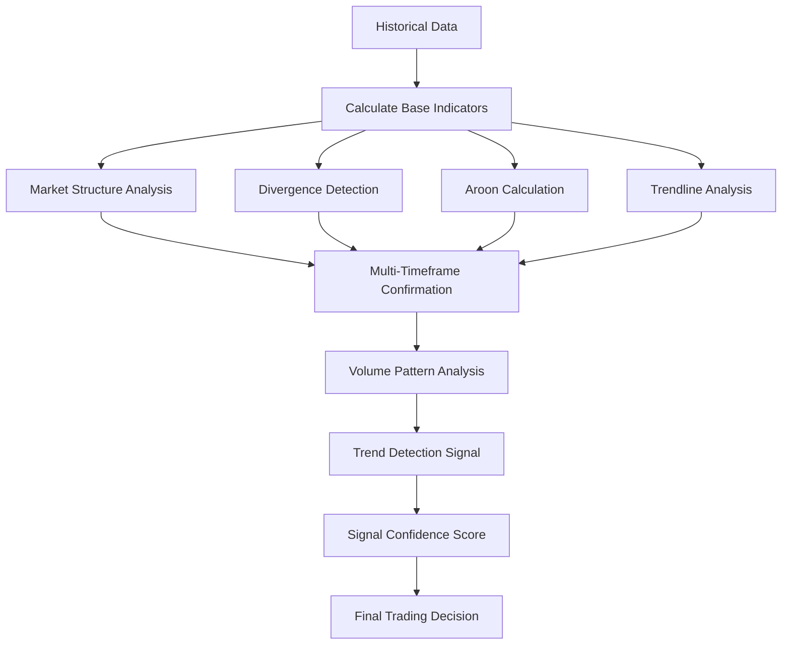

# Design Document: GEM Trading Bot Advanced Trend Detection

## Overview

This design document outlines the implementation of advanced trend change detection capabilities for the GEM Trading Bot. The enhancement will integrate sophisticated market structure analysis, divergence detection, multi-timeframe confirmation, and other advanced techniques into the existing MT5TradingBot architecture.

The system will maintain backward compatibility while providing configurable advanced features that can be enabled/disabled through the dashboard. The design follows the existing patterns established in the codebase, particularly the modular approach used by VolumeAnalyzer and AdaptiveRiskManager.

## Architecture

### High-Level Architecture

The trend detection system will be implemented as a modular component that integrates with the existing MT5TradingBot class. The architecture follows the established pattern of specialized analyzers:

```
MT5TradingBot
├── VolumeAnalyzer (existing)
├── AdaptiveRiskManager (existing)
└── TrendDetectionEngine (new)
    ├── MarketStructureAnalyzer
    ├── DivergenceDetector
    ├── AroonIndicator
    ├── TrendlineAnalyzer
    ├── MultiTimeframeAnalyzer
    └── VolumePatternAnalyzer
```

### Integration Points

The trend detection system will integrate at the following points in the existing workflow:

1. **Signal Generation Phase**: Enhance `check_entry_signal()` method with trend detection signals
2. **Filter Phase**: Add trend detection filters alongside existing RSI, MACD, and ADX filters
3. **Confidence Scoring**: Contribute to the overall signal confidence score
4. **Dashboard Controls**: Provide configuration interface for all trend detection features

### Data Flow



## Components and Interfaces

### 1. TrendDetectionEngine

**Purpose**: Main orchestrator for all trend detection functionality

**Interface**:
```python
class TrendDetectionEngine:
    def __init__(self, config: dict)
    def analyze_trend_change(self, df: pd.DataFrame, symbol: str) -> TrendAnalysisResult
    def get_trend_signals(self, df: pd.DataFrame, signal_type: str) -> List[TrendSignal]
    def calculate_trend_confidence(self, signals: List[TrendSignal]) -> float
    def should_trade_trend(self, df: pd.DataFrame, signal_type: str) -> Tuple[bool, float]
```

**Configuration Parameters**:
- `use_trend_detection`: Enable/disable entire system
- `trend_detection_sensitivity`: Overall sensitivity level (1-10)
- `min_trend_confidence`: Minimum confidence threshold (0.0-1.0)
- `enable_early_signals`: Enable early warning signals

### 2. MarketStructureAnalyzer

**Purpose**: Detect broken market structure patterns and support/resistance zones

**Interface**:
```python
class MarketStructureAnalyzer:
    def __init__(self, config: dict)
    def detect_structure_break(self, df: pd.DataFrame) -> StructureBreakResult
    def identify_support_resistance(self, df: pd.DataFrame) -> List[SRLevel]
    def calculate_structure_strength(self, break_info: StructureBreakResult) -> float
    def is_structure_confirmed(self, df: pd.DataFrame, break_level: float) -> bool
```

**Key Features**:
- Higher high/lower low detection with volume confirmation
- Dynamic support/resistance zone identification
- Structure break strength calculation based on volume and price movement
- Retest confirmation logic

### 3. DivergenceDetector

**Purpose**: Detect divergences between price and momentum indicators

**Interface**:
```python
class DivergenceDetector:
    def __init__(self, config: dict)
    def detect_rsi_divergence(self, df: pd.DataFrame) -> DivergenceResult
    def detect_macd_divergence(self, df: pd.DataFrame) -> DivergenceResult
    def validate_divergence(self, divergence: DivergenceResult) -> bool
    def calculate_divergence_strength(self, divergence: DivergenceResult) -> float
```

**Key Features**:
- Multi-swing point validation to reduce false signals
- Divergence magnitude calculation
- Time-based divergence validation
- Confidence scoring based on divergence clarity

### 4. AroonIndicator

**Purpose**: Calculate Aroon indicators for trend strength and direction analysis

**Interface**:
```python
class AroonIndicator:
    def __init__(self, period: int = 25)
    def calculate_aroon(self, df: pd.DataFrame) -> pd.DataFrame
    def get_aroon_signal(self, df: pd.DataFrame) -> AroonSignal
    def calculate_trend_strength(self, aroon_up: float, aroon_down: float) -> float
    def is_consolidation(self, aroon_up: float, aroon_down: float) -> bool
```

**Key Features**:
- Configurable period (20-50 range)
- Crossover signal detection
- Consolidation phase identification
- Trend strength measurement using Aroon oscillator

### 5. TrendlineAnalyzer

**Purpose**: Automatic trendline drawing and breach detection

**Interface**:
```python
class TrendlineAnalyzer:
    def __init__(self, config: dict)
    def identify_trendlines(self, df: pd.DataFrame) -> List[Trendline]
    def detect_trendline_breaks(self, df: pd.DataFrame, trendlines: List[Trendline]) -> List[TrendlineBreak]
    def validate_trendline(self, trendline: Trendline, df: pd.DataFrame) -> bool
    def detect_retest(self, df: pd.DataFrame, broken_trendline: Trendline) -> bool
```

**Key Features**:
- Swing high/low identification using pivot point detection
- Trendline validation based on touch points and duration
- Break detection with volume confirmation
- Retest confirmation logic
- Angle filtering to exclude overly steep/flat lines

### 6. MultiTimeframeAnalyzer

**Purpose**: Confirm signals across multiple timeframes

**Interface**:
```python
class MultiTimeframeAnalyzer:
    def __init__(self, config: dict)
    def get_higher_timeframe_data(self, symbol: str, primary_tf: int) -> pd.DataFrame
    def analyze_timeframe_alignment(self, primary_df: pd.DataFrame, higher_df: pd.DataFrame) -> TimeframeAlignment
    def calculate_alignment_score(self, alignment: TimeframeAlignment) -> float
    def should_confirm_signal(self, alignment: TimeframeAlignment, signal_type: str) -> bool
```

**Key Features**:
- Configurable timeframe relationships
- Trend alignment scoring
- Contradiction detection and handling
- Weighted confirmation based on timeframe importance

### 7. VolumePatternAnalyzer (Enhancement)

**Purpose**: Extend existing VolumeAnalyzer with trend-specific patterns

**Interface**:
```python
class VolumePatternAnalyzer:
    def detect_exhaustion_volume(self, df: pd.DataFrame) -> ExhaustionSignal
    def analyze_breakout_volume(self, df: pd.DataFrame, breakout_level: float) -> VolumeConfirmation
    def detect_volume_divergence_trend(self, df: pd.DataFrame) -> VolumeDivergence
    def calculate_volume_trend_strength(self, df: pd.DataFrame) -> float
```

**Key Features**:
- Volume spike detection at key levels
- Breakout volume confirmation
- Volume-price divergence specific to trend changes
- Integration with existing VolumeAnalyzer

## Data Models

### Core Data Structures

```python
@dataclass
class TrendAnalysisResult:
    signals: List[TrendSignal]
    confidence: float
    market_structure: StructureBreakResult
    divergences: List[DivergenceResult]
    aroon_signal: AroonSignal
    trendline_breaks: List[TrendlineBreak]
    timeframe_alignment: TimeframeAlignment
    volume_confirmation: VolumeConfirmation
    early_warnings: List[EarlyWarningSignal]

@dataclass
class TrendSignal:
    signal_type: str  # 'bullish_trend_change', 'bearish_trend_change'
    strength: float  # 0.0 to 1.0
    source: str  # 'market_structure', 'divergence', 'aroon', etc.
    confidence: float
    timestamp: datetime
    price_level: float
    supporting_factors: List[str]

@dataclass
class StructureBreakResult:
    break_type: str  # 'higher_high', 'lower_low', 'support_break', 'resistance_break'
    break_level: float
    previous_level: float
    volume_confirmation: bool
    strength: float
    confirmed: bool

@dataclass
class DivergenceResult:
    divergence_type: str  # 'bullish_rsi', 'bearish_rsi', 'bullish_macd', 'bearish_macd'
    indicator: str  # 'RSI', 'MACD'
    price_points: List[Tuple[datetime, float]]
    indicator_points: List[Tuple[datetime, float]]
    strength: float
    validated: bool

@dataclass
class AroonSignal:
    aroon_up: float
    aroon_down: float
    oscillator: float
    signal_type: str  # 'bullish_cross', 'bearish_cross', 'consolidation'
    trend_strength: float

@dataclass
class Trendline:
    start_point: Tuple[datetime, float]
    end_point: Tuple[datetime, float]
    slope: float
    touch_points: int
    strength: float
    line_type: str  # 'support', 'resistance'
    
@dataclass
class TrendlineBreak:
    trendline: Trendline
    break_point: Tuple[datetime, float]
    volume_confirmation: bool
    retest_confirmed: bool
    break_strength: float
```

## Correctness Properties

*A property is a characteristic or behavior that should hold true across all valid executions of a system-essentially, a formal statement about what the system should do. Properties serve as the bridge between human-readable specifications and machine-verifiable correctness guarantees.*

### Property 1: Market Structure Break Detection Accuracy
**Validates: Requirements 1.1, 1.2**

For any price series with identifiable trend structure:
- GIVEN a price series in an established uptrend with higher highs and higher lows
- WHEN price creates a new lower low that breaks the previous higher low
- THEN the system SHALL identify this as a broken bullish market structure
- AND the confidence level SHALL be proportional to the magnitude of the break
- AND the system SHALL correctly distinguish between minor pullbacks and structural breaks

### Property 2: RSI Divergence Detection Consistency  
**Validates: Requirements 2.1, 2.2**

For any price and RSI data with clear divergence patterns:
- GIVEN price data with swing highs/lows and corresponding RSI values
- WHEN price makes a higher high but RSI makes a lower high (bearish divergence)
- THEN the system SHALL detect and flag this as bearish RSI divergence
- AND WHEN price makes a lower low but RSI makes a higher low (bullish divergence)
- THEN the system SHALL detect and flag this as bullish RSI divergence
- AND the divergence strength SHALL correlate with the magnitude of the divergence

### Property 3: MACD Divergence Detection Consistency
**Validates: Requirements 2.3, 2.4**

For any price and MACD data with clear divergence patterns:
- GIVEN price data with swing points and corresponding MACD values
- WHEN price and MACD move in opposite directions at swing points
- THEN the system SHALL correctly identify the divergence type (bullish/bearish)
- AND the system SHALL validate divergences across multiple swing points
- AND false single-swing divergences SHALL be filtered out

### Property 4: Aroon Indicator Calculation Accuracy
**Validates: Requirements 4.1, 4.2, 4.3**

For any price data with configurable Aroon periods:
- GIVEN historical price data and a specified Aroon period
- WHEN calculating Aroon Up and Aroon Down indicators
- THEN the calculated values SHALL match standard Aroon formulas
- AND crossover signals SHALL be detected when Aroon Up crosses above/below Aroon Down
- AND consolidation phases SHALL be identified when both indicators are below 50

### Property 5: Trendline Identification and Validation
**Validates: Requirements 5.1, 5.4, 5.6**

For any price data with identifiable swing points:
- GIVEN price data with clear swing highs and lows
- WHEN identifying potential trendlines
- THEN trendlines SHALL connect at least 2 significant swing points
- AND trendlines SHALL be validated based on touch points and duration
- AND trendlines with angles too steep (>80°) or too flat (<10°) SHALL be filtered out
- AND the system SHALL maintain a maximum number of active trendlines

### Property 6: Trendline Break Detection with Volume Confirmation
**Validates: Requirements 5.2, 5.3**

For any trendline break scenario:
- GIVEN an established trendline and subsequent price movement
- WHEN price breaches the trendline with volume above average
- THEN the system SHALL generate a trendline break signal
- AND WHEN price retests the broken trendline and holds
- THEN the system SHALL generate a retest confirmation signal
- AND break signals without volume confirmation SHALL have reduced confidence

### Property 7: Multi-Timeframe Alignment Validation
**Validates: Requirements 6.1, 6.2, 6.3, 6.4**

For any multi-timeframe signal scenario:
- GIVEN signals on primary timeframe and higher timeframe data
- WHEN primary timeframe generates a signal
- THEN higher timeframe alignment SHALL be checked according to configured relationships
- AND contradictory higher timeframe signals SHALL reduce confidence scores
- AND 4-hour confirmation SHALL be required for 15-minute signals
- AND daily confirmation SHALL be required for 4-hour signals

### Property 8: Volume Pattern Analysis Accuracy
**Validates: Requirements 7.1, 7.2, 7.4**

For any volume and price data combination:
- GIVEN price and volume data with identifiable patterns
- WHEN volume spikes occur at key price levels
- THEN the system SHALL identify potential exhaustion signals
- AND WHEN price moves higher but volume decreases
- THEN volume-price divergence SHALL be detected
- AND volume confirmation SHALL increase breakout signal confidence

### Property 9: Early Warning Signal Generation
**Validates: Requirements 8.1, 8.2, 8.4**

For any trend weakness scenario:
- GIVEN an established trend with recent price action
- WHEN price fails to create new highs in an uptrend
- THEN the system SHALL identify potential trend weakness
- AND WHEN price fails to create new lows in a downtrend  
- THEN the system SHALL identify potential trend weakness
- AND early warning signals SHALL be generated before full reversal confirmation

### Property 10: System Performance and Reliability
**Validates: Requirements 11.1, 11.2**

For any real-time analysis scenario:
- GIVEN market data updates and analysis requirements
- WHEN performing trend detection analysis
- THEN analysis SHALL complete within 100ms per symbol per timeframe
- AND analysis failures SHALL be handled gracefully without stopping the main trading loop
- AND the system SHALL maintain stability during high-frequency data updates

### Property 11: Configuration Parameter Validation
**Validates: Requirements 9.3, 9.4**

For any configuration change:
- GIVEN configurable parameters for trend detection features
- WHEN parameters are modified within valid ranges
- THEN the system behavior SHALL change accordingly
- AND invalid parameter values SHALL be rejected with appropriate error messages
- AND parameter changes SHALL be reflected in real-time analysis

### Property 12: Signal Confidence Scoring Consistency
**Validates: Requirements 2.5, 7.4, 8.5**

For any generated signal:
- GIVEN multiple contributing factors to a trend detection signal
- WHEN calculating overall signal confidence
- THEN confidence scores SHALL be weighted appropriately by factor strength
- AND confidence scores SHALL remain within valid ranges (0.0 to 1.0)
- AND similar signal patterns SHALL produce consistent confidence scores
## Implementation Plan

### Phase 1: Core Infrastructure (Week 1-2)
1. **TrendDetectionEngine Framework**
   - Create base TrendDetectionEngine class with configuration management
   - Implement integration points with MT5TradingBot
   - Add configuration parameters to config.py and dashboard
   - Create data models and interfaces

2. **Basic Market Structure Analysis**
   - Implement MarketStructureAnalyzer with swing point detection
   - Add support/resistance zone identification
   - Create structure break detection logic
   - Add volume confirmation for structure breaks

### Phase 2: Indicator Implementation (Week 3-4)
1. **EMA Momentum Analysis**
   - Implement EMA calculation and crossover detection
   - Add EMA slope analysis for momentum confirmation
   - Integrate EMA as dynamic support/resistance levels

2. **Divergence Detection System**
   - Implement RSI divergence detection with multi-swing validation
   - Add MACD divergence detection with strength calculation
   - Create divergence confidence scoring system

3. **Aroon Indicator Integration**
   - Implement Aroon Up/Down calculation
   - Add crossover signal detection and trend strength measurement
   - Create consolidation phase identification

### Phase 3: Advanced Analysis (Week 5-6)
1. **Trendline Analysis System**
   - Implement automatic trendline identification using swing points
   - Add trendline validation based on touch points and duration
   - Create trendline break detection with volume confirmation
   - Implement retest confirmation logic

2. **Multi-Timeframe Confirmation**
   - Implement higher timeframe data retrieval
   - Add timeframe alignment analysis and scoring
   - Create configurable timeframe relationship management

### Phase 4: Integration and Testing (Week 7-8)
1. **Volume Pattern Enhancement**
   - Extend existing VolumeAnalyzer with trend-specific patterns
   - Add exhaustion detection and breakout confirmation
   - Implement volume-price divergence analysis

2. **Dashboard Integration**
   - Add trend detection controls to dashboard
   - Implement real-time signal display
   - Create configuration panels for all parameters

3. **Performance Optimization**
   - Optimize analysis algorithms for real-time performance
   - Implement memory-efficient data storage
   - Add error handling and recovery mechanisms

### Phase 5: Testing and Validation (Week 9-10)
1. **Property-Based Testing**
   - Implement comprehensive property tests for all correctness properties
   - Create test data generators for various market scenarios
   - Add performance benchmarking and stress testing

2. **Integration Testing**
   - Test integration with existing MT5TradingBot functionality
   - Validate backward compatibility with current signal generation
   - Perform end-to-end testing with live market data

## Testing Strategy

### Unit Testing
- **Component Isolation**: Test each analyzer component independently
- **Mock Data**: Use synthetic market data with known patterns
- **Edge Cases**: Test boundary conditions and error scenarios
- **Performance**: Validate timing requirements for each component

### Property-Based Testing
- **Market Structure Properties**: Generate random price series with known structure breaks
- **Divergence Properties**: Create price/indicator combinations with controlled divergences
- **Trendline Properties**: Generate swing point data with identifiable trendlines
- **Multi-Timeframe Properties**: Test alignment across different timeframe combinations

### Integration Testing
- **Signal Generation**: Test complete signal generation pipeline
- **Configuration Changes**: Validate system behavior with different parameter settings
- **Error Handling**: Test graceful failure and recovery scenarios
- **Performance**: Stress test with high-frequency market data updates

### Acceptance Testing
- **Historical Backtesting**: Validate against known historical trend changes
- **Live Market Testing**: Test with real-time market data in demo environment
- **User Acceptance**: Validate dashboard functionality and user workflows

## Risk Mitigation

### Technical Risks
1. **Performance Impact**: Mitigate through algorithm optimization and caching
2. **Memory Usage**: Implement efficient data structures and cleanup routines
3. **Integration Complexity**: Use existing patterns and maintain backward compatibility

### Market Risks
1. **False Signals**: Implement multi-factor confirmation and confidence scoring
2. **Market Regime Changes**: Provide configurable parameters for different market conditions
3. **Latency Issues**: Optimize for real-time analysis with sub-100ms requirements

### Operational Risks
1. **Configuration Errors**: Implement parameter validation and safe defaults
2. **System Stability**: Add comprehensive error handling and recovery mechanisms
3. **User Adoption**: Provide clear documentation and intuitive dashboard controls

## Success Criteria

### Functional Success
- All correctness properties pass property-based testing
- Integration with existing system maintains backward compatibility
- Dashboard provides intuitive control over all trend detection features
- System meets performance requirements (100ms per symbol per timeframe)

### Business Success
- Improved signal quality with reduced false positives
- Enhanced trend change detection accuracy
- Increased user confidence through multi-factor confirmation
- Successful deployment without disruption to existing trading operations

## Conclusion

This design provides a comprehensive framework for implementing advanced trend detection capabilities in the GEM Trading Bot. The modular architecture ensures maintainability and extensibility, while the rigorous testing strategy validates correctness and performance. The phased implementation plan allows for incremental development and validation, reducing risk and ensuring successful delivery of this critical enhancement.

The integration of market structure analysis, divergence detection, multi-timeframe confirmation, and volume analysis will significantly improve the bot's ability to detect trend changes early and accurately. The property-based testing approach ensures that all correctness properties are validated across a wide range of market scenarios, providing confidence in the system's reliability and performance.